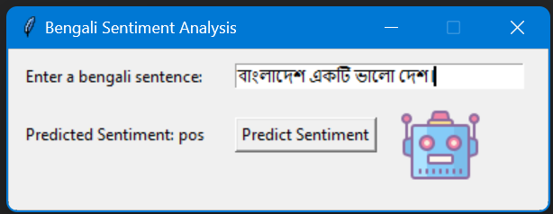
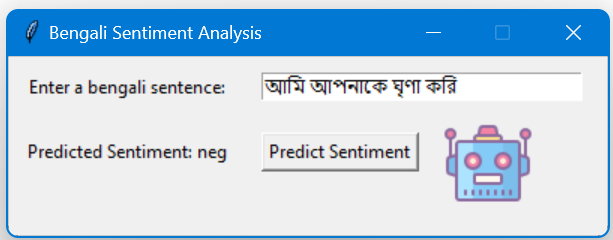
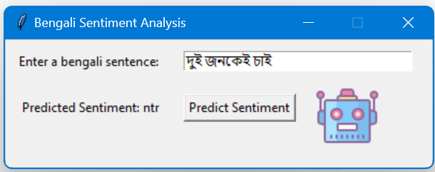

---

# Bengali Sentiment Analysis

This project involves sentiment analysis for Bengali text. It reads data from a file, processes the text to clean and remove stop words, and uses a machine learning model to predict the sentiment of the input text. The application includes a graphical user interface (GUI) for user interaction.

## Table of Contents
- [Installation](#installation)
- [Usage](#usage)
- [Project Structure](#project-structure)
- [Data Preparation](#data-preparation)
- [Text Processing](#text-processing)
- [Model Prediction](#model-prediction)
- [GUI](#gui)
- [Example Images](#example-images)

## Installation

1. Clone the repository:
   ```sh
   git clone https://github.com/SHIV-360/SENTIMENT_ANALYSIS-for-BENGALI-LANGUAGE.git
   ```
2. Change to the project directory:
   ```sh
   cd bengali-sentiment-analysis
   ```
3. Install the required packages:
   ```sh
   pip install tkinter scikit-learn numpy pandas nltk re os
   ```

## Usage

1. Ensure you have your data file (`data.txt`) and logo image (`logo.png`) in the project directory.

2. Run the application:
   ```sh
   python file_name.py
   ```

## Project Structure

- `data.txt`: Input data file containing labeled sentences in Bengali.
- `logo.png`: Logo image for the GUI.
- `app.py`: Main application file containing the code for data processing, model prediction, and GUI.
- `README.md`: This README file.
- `model.pkl`: Trained machine learning model file.

## Data Preparation

The data file (`data.txt`) should be structured with each line containing a label (negative, positive, or neutral) followed by a tab and the Bengali sentence. The data is read from this file, and each sentence is cleaned by removing unnecessary characters and stop words.

## Text Processing

The text processing involves cleaning the text by removing punctuation, special characters, URLs, and stop words. This prepares the text for vectorization.

### Cleaning Function

The cleaning function removes unnecessary characters from the text to prepare it for analysis.

### Removing Stop Words

The stop words removal function filters out common Bengali stop words that do not contribute to the sentiment analysis.

## Model Prediction

The cleaned and processed text is converted into feature vectors using a vectorization technique. These feature vectors are then fed into a trained machine learning model to predict the sentiment of the input text.

## GUI

A graphical user interface is created using `tkinter` for user interaction. Users can input Bengali text into the GUI, and it will display the predicted sentiment. The GUI includes input fields, a predict button, and a label to show the prediction result.

## Example Images

Use the following example images to understand the sentiment predictions:

1. **Positive Example**: 
2. **Negative Example**: 
3. **Neutral Example**: 

---